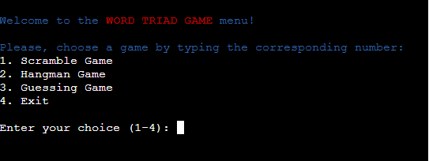

<h1 align="center">Word Triad Game</h1>

[View the live project here]()

## Index – Table of Contents
* [Introduction](#introduction)
* [User Experience (UX)](#user-experience-ux) 
* [Features](#features)
* [Data Model](#data-model)
* [Issues and Bugs](#issues-and-bugs)
* [Technologies Used](#technologies-used)
* [Testing](#testing)
* [Deployment](#deployment)
* [Credits](#credits)

## Introduction

...

## User Experience (UX)

### User stories
*...
*
*

## Features

### Existing Features

-   __Menu__
    - The WordTriadGame starts with a menu where the user can choose from different game options. 
      

-   __Scramble Game__
    - The first option is ScrambleGame.
    - The user has to choose the difficulty level of the game.
    - Invalid message will appear if the option is not written correctly.
    - If typing 'quit' will go back to the main menu.
    - The user has to unscramble the word displayed to achive points.
    - The word is randomly choosed from the Google Sheets document based on difficulty level.
    - A message will let the user know if he unscramble the word correctly or not.
    - At the end of the game the user see a 'thank you' message and the score.
    - The user has the option to 'play again' or to 'go back' to the main menu.
    - Invalid message will appear if the option is not written correctly.
      

-   __Hangman Game__
    - The second option is HangmanGame.
    - The user has to choose the difficulty level of the game.
    - Invalid message will appear if the option is not written correctly.
    - If typing 'quit' will go back to the main menu.
    - Will be displayed to the user: the attempts remaining, a list with the gussed letters, the word to guess will be hiden by '_' and an input.
    - A message will let the user know if he guessed the letter typed correctly or not.
    - Invalid message will appear if the user is typing a number or multiple letters.
    - At the end of the game the user see a 'thank you' message and the score.
    - The user has the option to 'play again' or to 'go back' to the main menu.
    - Invalid message will appear if the option is not written correctly.
      

-   __Guessing Game__
    - The third option is GuessingGame.
    - A welcome message is displayed.
    - The user need to guess a randomly generated number between 1 and 10.
    - A message will let the user know if the typed number is to low, to high or correct.
    - Invalid message will be displayed if you choose another charachter then a number.
    - At the end of the game the user see a 'thank you' message.
    - The user has the option to 'play again' or to 'go back' to the main menu.
      

-   __Exit__
    - The user can choose to exit the game at any time
    - A specific message will be displayed.
      

## Data Model
-   ### Google Sheets:
    - is used as a data source for storing the word lists for the Scramble and Hangman games.
-   ### Google API:
    - is used to access and retrieve data from Google Sheets document.
    - a service account and credentials are required for authentication and authorization.
-   ### Data Structure:
    - the word lists is stored in a dataFrame.
    - each row representing a word with an associated metadata such as difficulty level.
-   ### In-memory Data:
    - during the gameplay, the selected word list, the used words and scores are stored in memory.

## Issues and Bugs
-   ### Solved
    - The score of the Scramble game does not appear
        * I fixed the issue by moving the next-action code block at the end of the function.
    - The quit option wasn't work correctly
        * I fixed the issue by removing the call of the main function

## Language Used
-   [Python](https://en.wikipedia.org/wiki/Python_(programming_language))

### Frameworks, Libraries & Programs Used

-   [Google API:](https://console.cloud.google.com/welcome?project=wordtriadgame) and [Google Sheets:](https://docs.google.com/spreadsheets/u/0/) was used to access and retrieve word lists stored in the Google Sheets document.
-   [GitHub:](https://github.com/) is used as the respository for the projects code after being pushed from Git.
-   [Heroku:](https://dashboard.heroku.com/apps) was used for deploy.
-   [Colorama:](https://pypi.org/project/colorama/) was used to add styling to the prompt text.

## Testing

- [Python Validator](https://pep8ci.herokuapp.com/#)
    - result for run.py
        

- [Lighthouse]

    - result from inspect -> Lighthouse 
      

### User Tests

|  Test Case    | Navigation and Menu |
| ------------- | ------------- |
| Test          | Navigate through the menu options and go back to the main menu.  |
| Action        | Choose different games, play them, and go back to the main menu.  |
| Expect        | Verify if the menu options work as aspect, the user is able to select different games, play them, and go back to the main menu without any issues.  |

|  Test Case    | Scramble Game |
| ------------- | ------------- |
| Test          | Start the Scramble Game and choose a difficulty level.  |
| Action        | Try to unscramble the word by entering your guess.  |
| Expect        | Verify if the game correctly checks your guess and gives feedback on whether it is correct or incorrect. Test different difficulty levels and ensure the game behaves as expected.  |

|  Test Case    | Hangman Game |
| ------------- | ------------- |
| Test          | Start the Hangman Game and choose a difficulty level.  |
| Action        | Guess letters to expose the hidden word within the given attempts.  |
| Expect        | Verify if the game displays correctly the hidden word, tracks the guessed letters, and provides feedback on correct and incorrect guesses. Ensure the game ends correctly when all attempts are used or the word is correctly guessed.  |

|  Test Case    | Guessing Game |
| ------------- | ------------- |
| Test          | Start the Guessing Game and play multiple rounds.  |
| Action        | Enter guesses to find out the randomly generated number.  |
| Expect        | Verify if the game accepts valid numeric guesses, provides feedback on whether the guess is too high or too low, and ends correctly when the correct number is guessed or all attempts are used.  |

|  Test Case    | Quit/Exit and Restart |
| ------------- | ------------- |
| Test          | Test the quit/exit and restart functionality within the games.  |
| Action        | Choose to quit a game and verify if it returns to the main menu. Choose to restart a game and ensure it starts a new round without any issues. Choose to exit from the main menu and ensure the end of the WordTriadGame. |
| Expect        | Verify if the quit option returns the user to the main menu. If the restart option properly restarts the game without any leftover data from the previous round. And If the exit option will display a goodbye message. |

## Deployment

- This project was developed using [CodeAnyWhere](https://codeanywhere.com/).
- I have used the terminal to commit changes in my GitHub repository.
- In the GitHub I have created Issues, the commits are related to the Issues.

### Deploying on Heroku Pages
To deploy this game to Heroku Pages from GitHub repository, the following steps were taken:

1. Log into [GitHub](https://github.com/login "Link to GitHub login page") or [create an account](https://github.com/join "Link to GitHub create account page").
2. Locate the [GitHub Repository](https://github.com/GeorgeH23/word-triad-game "Link to GitHub Repo").
3. Create an account on [Heroku:](https://dashboard.heroku.com/apps).
4. Create a new Heroku app.
5. Set the BuilPacks and the Config Vars.
6. Link the Heroku app to the git hub repository.
7. Click on Deploy.

## Credits 

### Content 
- The ReadME file was inspired from my first project [Travel Addict](https://github.com/GeorgeH23/travel-addict/blob/main/README.md) and [Ultimate Battleships](https://learn.codeinstitute.net/courses/course-v1:CodeInstitute+PE_PAGPPF+2021_Q2/courseware/b3378fc1159e43e3b70916fdefdfae51/605f34e006594dc4ae19f5e60ec75e2e/)
- All other content was written by the developer

https://docs.google.com/spreadsheets/d/16ijUIiLiN7GW1yUDY_z4mYLmxeQiJapEfyfJeMbvv2o/edit#gid=0